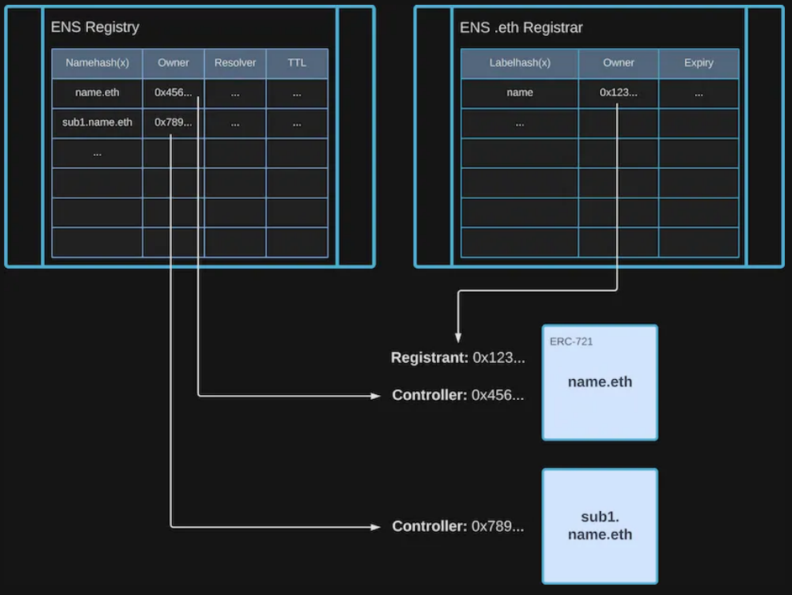
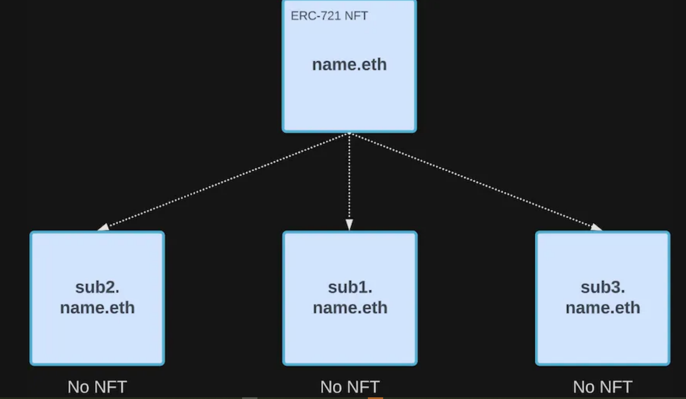
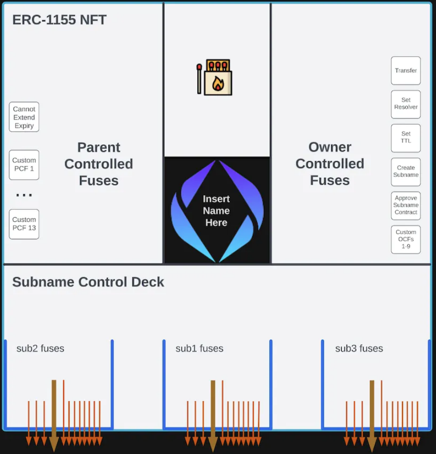
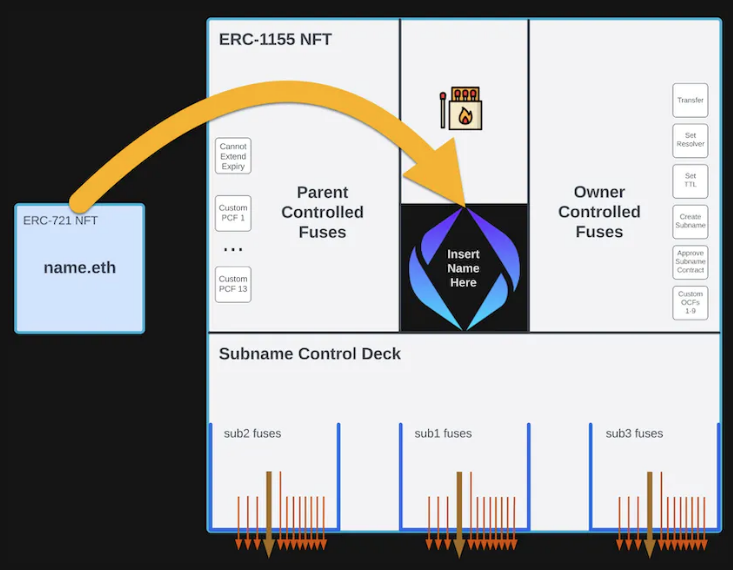
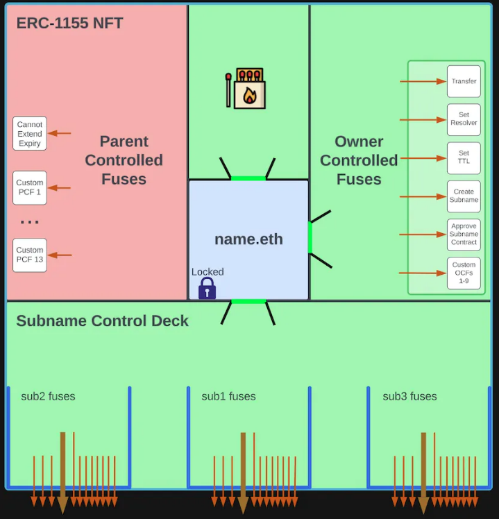
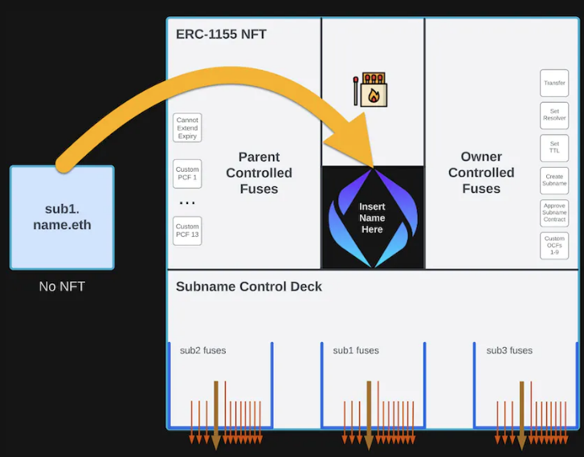
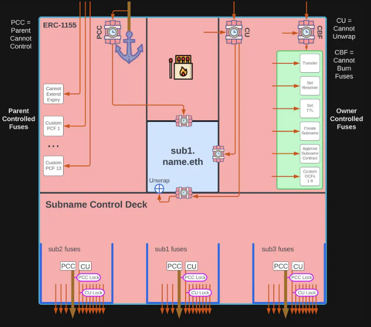
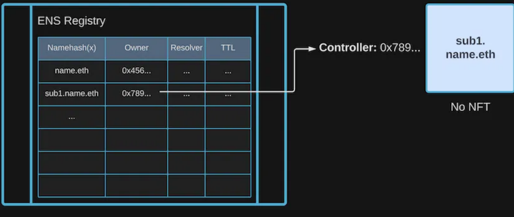
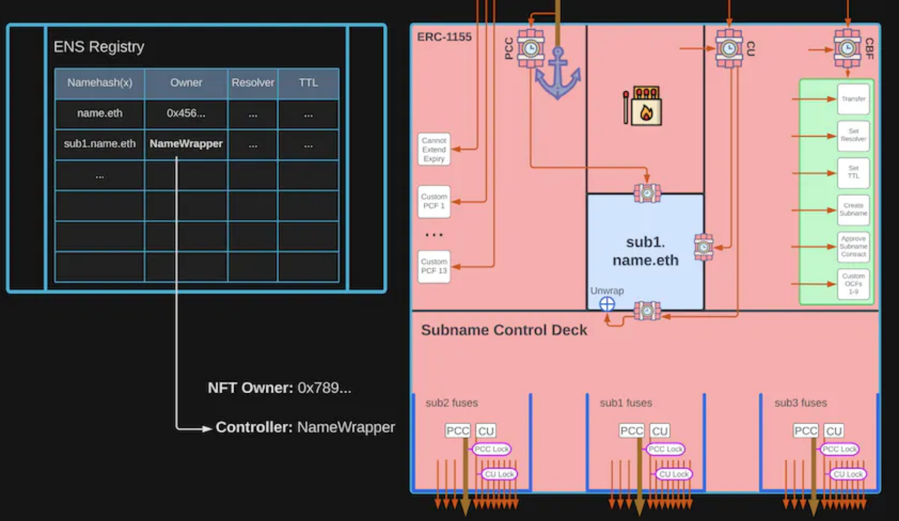
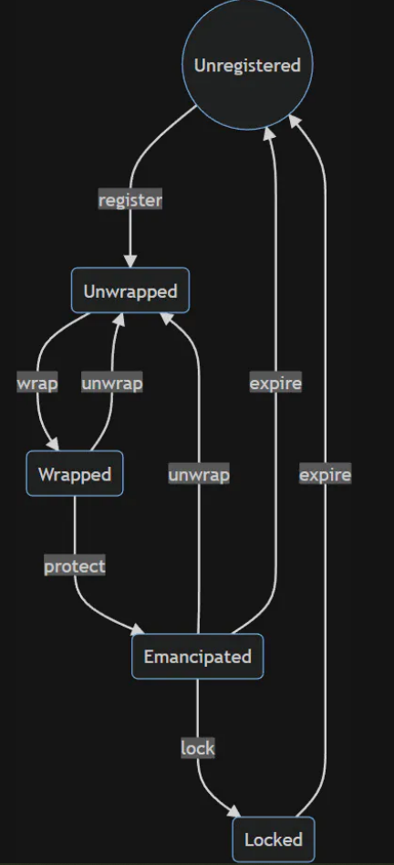

# Table of Contents
- [Table of Contents](#table-of-contents)
  - [Introduction](#introduction)
  - [The ENS Name Wrapper](#the-ens-name-wrapper)
    - [Registry Owners with the Name Wrapper](#registry-owners-with-the-name-wrapper)
    - [States of an ENS Name](#states-of-an-ens-name)
  - [Example - Step By Step](#example---step-by-step)
  - [Example - Parent Locks Subname All-In-One](#example---parent-locks-subname-all-in-one)
  - [Example - Multiple Subnames in Various States](#example---multiple-subnames-in-various-states)
  - [Name Wrapper Fuses](#name-wrapper-fuses)
  - [Name Wrapper Expiry](#name-wrapper-expiry)
  - [Approved Operators](#approved-operators)

## Introduction
Trước khi chúng tôi đi sâu vào **Name Wrapper**, hãy tóm tắt ngắn gọn một số khái niệm ENS cơ bản sẽ cung cấp một số context hữu ích.

**Registry** là contract cốt lõi ở trung tâm của giải pháp ENS. Tất cả các tra cứu ENS bắt đầu bằng cách truy vấn registry. Registry không chỉ dành cho các tên second-level cua .eth (như `name.eth`) mà còn cho tất cả các tên ENS (các tên phụ như `sub.name.eth` và cả các tên DNS như `domain.xyz`). Chủ sở hữu tên trong registry còn được gọi là Controller hoặc Manager của tên.

**.eth Registrar** dành riêng cho đăng ký tên second-level .eth. Đây thực chất là một registrar cho tên miền phụ cho TLD (top-level domain) .eth. Khi bạn đăng ký một tên .eth, registrar sẽ cấp cho bạn một ERC-721 NFT.

Chủ sở hữu của NFT đó còn được gọi là Registrant hoặc Owner của tên đó. Nó cũng có thể được sử dụng để đòi lại quyền sở hữu đối với tên trong core registry (nói cách khác, Registrant có thể ghi đè lên Controller).

Có thể thấy, không có Name Wrapper, hiện tại chỉ có các tên sencond-level .eth là NFT. Theo mặc định, tên phụ và miền DNS không có NFT được liên kết với chúng, trừ khi hợp đồng tùy chỉnh được tạo cho mục đích đó.

## The ENS Name Wrapper

Name Wrapper bao bọc một tên ENS thành một ERC-1155 NFT mới. Bất kỳ tên ENS nào cũng có thể được bao bọc, cho dù đó là tên .eth hay tên miền DNS hay thậm chí là bất kỳ tên phụ nào!

Bạn có thể lấy tên `name.eth`…

Và biến nó thành ERC-1155 NFT được bọc!

Hãy lấy subname `sub1.name.eth` của chúng ta từ phía trên và bọc nó!

Bây giờ tên phụ cũng là một ERC-1155 NFT được bao bọc!

Những dòng bạn nhìn thấy đại diện cho cái gọi là "permission fuses" cho tên ENS được bao bọc của bạn, mà tôi sẽ giải thích một chút.

### Registry Owners with the Name Wrapper
Khi bạn bọc một tên, bạn đang đặt Owner thành Name Wrapper contract. Đổi lại, Name Wrapper phát hành một ERC-1155 NFT và chuyển nó cho bạn.

Đối với tên sencond-level .eth, bạn chuyển Registrant / NFT (trong công ty đăng ký tên miền .eth) sang Name Wrapper contract khi bạn bao bọc. Name Wrapper cũng sẽ tự động lấy lại Owner trong core Registry.

Trước đây, không có NFT nào cả (ít nhất là đối với tên con và tên DNS):

\
*Registry Controller of an unwrapped subname*

Sau khi bạn đặt tên, về mặt kỹ thuật, Owner trong Registry hiện là Name Wrapper contract. Điều đó có nghĩa là bạn không thể tương tác trực tiếp với ENS Registry cho tên đó vì bạn không phải là Owner.

Tuy nhiên, Name Wrapper contrat cung cấp tất cả các method cần thiết để bạn vẫn có thể tương tác với Registry. Bạn có thể chuyển quyền sở hữu, set reolver/ttl và thậm chí tạo tên phụ giống như bình thường. Trên hết, bất kỳ tên phụ nào bạn tạo cũng sẽ được tự động bọc theo mặc định!

\
*Registry Controller of a wrapped subname is now the Name Wrapper contract*

### States of an ENS Name
Ngoài tất cả các chức năng mà tên có được khi trở thành một ERC-1155 NFT chính thức, Name Wrapper cũng cung cấp một số tính năng dành riêng cho ENS.

Nó thực hiện điều này với một hệ thống *cầu chì*. Mỗi *cầu chì* đại diện cho một số loại quyền cho tên. Khi bạn đốt *cầu chì*, bạn thường thu hồi một số loại quyền. Trong giao diện người dùng ENS Manager, điều này có sẵn trong phần "Permission" của tên.

Ví dụ: theo mặc định khi đặt tên, bạn có thể tự do chuyển NFT, giống như bạn có thể làm với các NFT khác. Tuy nhiên, nếu *cầu chì* “Cannot Transfer” bị cháy, thì NFT sẽ không thể chuyển nhượng được. Trong ENS Manager UI, bạn sẽ thực hiện việc này bằng cách thu hồi quyền “Can send this name”.

Như tên của nó, một khi bạn đốt cháy cầu chì, bạn không thể hoàn tác hành động đó, ít nhất là cho đến khi hết hạn.

**Expiry** là khoảng thời gian các cầu chì hoạt động. Thời hạn của tên do parent owner đặt. Đối với tên second-level .eth, ngày hết hạn được đặt thành cùng thời hạn từ .eth registrar. Khi hết hạn, tất cả các cầu chì được đặt lại. Ngoài ra, nếu tên của bạn được *giải phóng* hoặc *bị khóa*, thì bạn sẽ mất quyền sở hữu tên khi hết hạn. Phần sau đó đi sâu vào chi tiết hơn về expiry.

Ngoài ra còn có các cầu chì đặc biệt xác định mối quan hệ giữa tên "cha" và "con" hoặc thay đổi trạng thái của tên được bọc. Một tên có thể ở một trong những trạng thái sau:

- **Unregistered**: Tên thậm chí chưa được đăng ký/tạo hoặc đã hết hạn.
- **Unwrapped**: Tên tồn tại và chưa hết hạn (trong trường hợp tên second-level .eth). Name Wrapper contract không có quyền sở hữu tên. Bạn sở hữu tên trong Registry và/hoặc .eth registrar.
- **Wrapped**: Name Wrapper contract có quyền sở hữu tên (trong Registry/Registrar). Đổi lại, bạn được cấp một ERC-1155 NFT, điều này chứng minh rằng bạn là chủ sở hữu thực sự. Bạn có thể unwrap tên bất kỳ lúc nào, thao tác này sẽ burn ERC-1155 NFT và trả lại quyền sở hữu trong Registry/Registrar cho bạn. Nếu tên của bạn là một tên phụ như `sub.name.eth`, thì owner của `name.eth` về mặt kỹ thuật có thể thay thế tên phụ đó và chuyển nó cho một owner khác. Ngoài ra, parent owner có thể đốt cầu chì *parent-controlled* trong tên của bạn.
- **Emancipated**: owner của parent name không còn có thể thay thế tên này hoặc đốt thêm bất kỳ *cầu chì* trong đó. Tất cả các tên second-level .eth (như `name.eth`) sẽ tự động được đưa vào trạng thái **Giải phóng** khi được bọc. Owner vẫn có thể *unwrap* và *rewrap* tên.
- **Locked**: Tên không còn có thể được unwrap. Owner có thể đốt cầu chì *owner-controlled* trong nó. Các cầu chì cho tên phụ (`sub1.name.eth`) của tên này (`name.eth`) cũng có thể bị đốt.

\
*State Machine for the ENS Name Wrapper*

## Example - Step By Step
## Example - Parent Locks Subname All-In-One
## Example - Multiple Subnames in Various States
## Name Wrapper Fuses
## Name Wrapper Expiry
## Approved Operators

