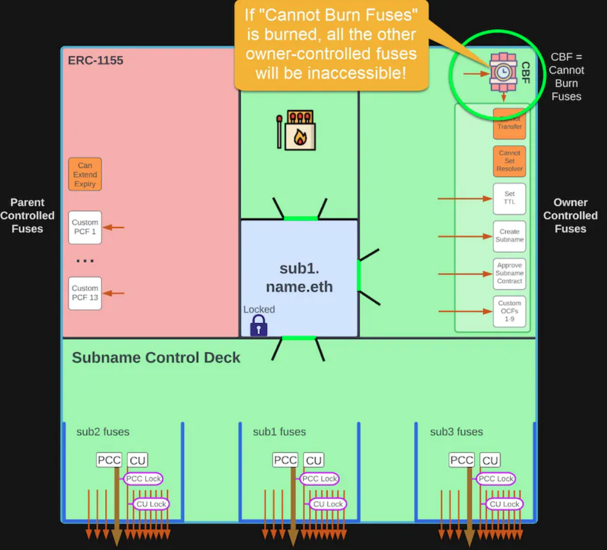

# Table of Contents
- [Table of Contents](#table-of-contents)
  - [Introduction](#introduction)
  - [The ENS Name Wrapper](#the-ens-name-wrapper)
    - [Registry Owners with the Name Wrapper](#registry-owners-with-the-name-wrapper)
    - [States of an ENS Name](#states-of-an-ens-name)
  - [Example - Step By Step](#example---step-by-step)
    - [Wrapped Subnames](#wrapped-subnames)
    - [Burning Parent-Controlled Fuses](#burning-parent-controlled-fuses)
    - [Burning the “Parent Cannot Control” Fuse](#burning-the-parent-cannot-control-fuse)
    - [Emancipated Subnames](#emancipated-subnames)
    - [Burning the “Cannot Unwrap” Fuse](#burning-the-cannot-unwrap-fuse)
    - [Locked Subnames](#locked-subnames)
    - [Burning Owner-Controlled Fuses](#burning-owner-controlled-fuses)
    - [Burning the “Cannot Burn Fuses” Fuse](#burning-the-cannot-burn-fuses-fuse)
    - [All Fuses Frozen](#all-fuses-frozen)
  - [Example - Parent Locks Subname All-In-One](#example---parent-locks-subname-all-in-one)
  - [Example - Multiple Subnames in Various States](#example---multiple-subnames-in-various-states)
  - [Name Wrapper Fuses](#name-wrapper-fuses)
  - [Name Wrapper Expiry](#name-wrapper-expiry)
    - [Max Expiry for Subnames](#max-expiry-for-subnames)
    - [Renewal](#renewal)
    - [Special Cases for .eth 2LDs](#special-cases-for-eth-2lds)
    - [Expiry Implications](#expiry-implications)
  - [Approved Operators](#approved-operators)
    - [Full-Control Operator Batch Approvals](#full-control-operator-batch-approvals)
    - [Name-Specific Subname Renewal Manager Approvals](#name-specific-subname-renewal-manager-approvals)
    - [Example - Subname Registrar Contract](#example---subname-registrar-contract)
  - [DNS Domains and Fuses](#dns-domains-and-fuses)
  - [Use-Cases](#use-cases)
    - [1. I want to give subnames out to all of my DAO members / NFT holders!](#1-i-want-to-give-subnames-out-to-all-of-my-dao-members--nft-holders)
    - [2. I want to sell / rent out subnames!](#2-i-want-to-sell--rent-out-subnames)
    - [3. Other cool things you can do](#3-other-cool-things-you-can-do)

## Introduction
Trước khi chúng tôi đi sâu vào **Name Wrapper**, hãy tóm tắt ngắn gọn một số khái niệm ENS cơ bản sẽ cung cấp một số context hữu ích.

**Registry** là contract cốt lõi ở trung tâm của giải pháp ENS. Tất cả các tra cứu ENS bắt đầu bằng cách truy vấn registry. Registry không chỉ dành cho các tên second-level cua .eth (như `name.eth`) mà còn cho tất cả các tên ENS (các subname như `sub.name.eth` và cả các tên DNS như `domain.xyz`). Chủ sở hữu tên trong registry còn được gọi là Controller hoặc Manager của tên.

**.eth Registrar** dành riêng cho đăng ký tên second-level .eth. Đây thực chất là một registrar cho tên miền phụ cho TLD (top-level domain) .eth. Khi bạn đăng ký một tên .eth, registrar sẽ cấp cho bạn một ERC-721 NFT.

Chủ sở hữu của NFT đó còn được gọi là Registrant hoặc Owner của tên đó. Nó cũng có thể được sử dụng để đòi lại quyền sở hữu đối với tên trong core registry (nói cách khác, Registrant có thể đốt đè lên Controller).

Có thể thấy, không có Name Wrapper, hiện tại chỉ có các tên sencond-level .eth là NFT. Theo mặc định, subname và miền DNS không có NFT được liên kết với chúng, trừ khi hợp đồng tùy chỉnh được tạo cho mục đích đó.

## The ENS Name Wrapper

Name Wrapper bao bọc một tên ENS thành một ERC-1155 NFT mới. Bất kỳ tên ENS nào cũng có thể được bao bọc, cho dù đó là tên .eth hay tên miền DNS hay thậm chí là bất kỳ subname nào!

Bạn có thể lấy tên `name.eth`…

Và biến nó thành ERC-1155 NFT được bọc!

Hãy lấy subname `sub1.name.eth` của chúng ta từ phía trên và bọc nó!

Bây giờ subname cũng là một ERC-1155 NFT được bao bọc!

Những dòng bạn nhìn thấy đại diện cho cái gọi là "permission fuses" cho tên ENS được bao bọc của bạn, mà tôi sẽ giải thích một chút.

### Registry Owners with the Name Wrapper
Khi bạn bọc một tên, bạn đang đặt Owner thành Name Wrapper contract. Đổi lại, Name Wrapper phát hành một ERC-1155 NFT và chuyển nó cho bạn.

Đối với tên sencond-level .eth, bạn chuyển Registrant / NFT (trong công ty đăng ký tên miền .eth) sang Name Wrapper contract khi bạn bao bọc. Name Wrapper cũng sẽ tự động lấy lại Owner trong core Registry.

Trước đây, không có NFT nào cả (ít nhất là đối với tên con và tên DNS):

\
*Registry Controller of an unwrapped subname*

Sau khi bạn đặt tên, về mặt kỹ thuật, Owner trong Registry hiện là Name Wrapper contract. Điều đó có nghĩa là bạn không thể tương tác trực tiếp với ENS Registry cho tên đó vì bạn không phải là Owner.

Tuy nhiên, Name Wrapper contrat cung cấp tất cả các method cần thiết để bạn vẫn có thể tương tác với Registry. Bạn có thể chuyển quyền sở hữu, set reolver/ttl và thậm chí tạo subname giống như bình thường. Trên hết, bất kỳ subname nào bạn tạo cũng sẽ được tự động bọc theo mặc định!

\
*Registry Controller of a wrapped subname is now the Name Wrapper contract*

### States of an ENS Name
Ngoài tất cả các chức năng mà tên có được khi trở thành một ERC-1155 NFT chính thức, Name Wrapper cũng cung cấp một số tính năng dành riêng cho ENS.

Nó thực hiện điều này với một hệ thống *cầu chì*. Mỗi *cầu chì* đại diện cho một số loại quyền cho tên. Khi bạn đốt *cầu chì*, bạn thường thu hồi một số loại quyền. Trong giao diện người dùng ENS Manager, điều này có sẵn trong phần "Permission" của tên.

Ví dụ: theo mặc định khi đặt tên, bạn có thể tự do chuyển NFT, giống như bạn có thể làm với các NFT khác. Tuy nhiên, nếu *cầu chì* “Cannot Transfer” bị cháy, thì NFT sẽ không thể chuyển nhượng được. Trong ENS Manager UI, bạn sẽ thực hiện việc này bằng cách thu hồi quyền “Can send this name”.

Như tên của nó, một khi bạn đốt cháy cầu chì, bạn không thể hoàn tác hành động đó, ít nhất là cho đến khi hết hạn.

**Expiry** là khoảng thời gian các cầu chì hoạt động. Thời hạn của tên do parent owner đặt. Đối với tên second-level .eth, ngày hết hạn được đặt thành cùng thời hạn từ .eth registrar. Khi hết hạn, tất cả các cầu chì được đặt lại. Ngoài ra, nếu tên của bạn được *giải phóng* hoặc *bị khóa*, thì bạn sẽ mất quyền sở hữu tên khi hết hạn. Phần sau đó đi sâu vào chi tiết hơn về expiry.

Ngoài ra còn có các cầu chì đặc biệt xác định mối quan hệ giữa tên "cha" và "con" hoặc thay đổi trạng thái của tên được bọc. Một tên có thể ở một trong những trạng thái sau:

- **Unregistered**: Tên thậm chí chưa được đăng ký/tạo hoặc đã hết hạn.
- **Unwrapped**: Tên tồn tại và chưa hết hạn (trong trường hợp tên second-level .eth). Name Wrapper contract không có quyền sở hữu tên. Bạn sở hữu tên trong Registry và/hoặc .eth registrar.
- **Wrapped**: Name Wrapper contract có quyền sở hữu tên (trong Registry/Registrar). Đổi lại, bạn được cấp một ERC-1155 NFT, điều này chứng minh rằng bạn là chủ sở hữu thực sự. Bạn có thể unwrap tên bất kỳ lúc nào, thao tác này sẽ burn ERC-1155 NFT và trả lại quyền sở hữu trong Registry/Registrar cho bạn. Nếu tên của bạn là một subname như `sub.name.eth`, thì owner của `name.eth` về mặt kỹ thuật có thể thay thế subname đó và chuyển nó cho một owner khác. Ngoài ra, parent owner có thể đốt cầu chì *parent-controlled* trong tên của bạn.
- **Emancipated**: owner của parent name không còn có thể thay thế tên này hoặc đốt thêm bất kỳ *cầu chì* trong đó. Tất cả các tên second-level .eth (như `name.eth`) sẽ tự động được đưa vào trạng thái **Giải phóng** khi được bọc. Owner vẫn có thể *unwrap* và *rewrap* tên.
- **Locked**: Tên không còn có thể được unwrap. Owner có thể đốt cầu chì *owner-controlled* trong nó. Các cầu chì cho subname (`sub1.name.eth`) của tên này (`name.eth`) cũng có thể bị đốt.

\
*State Machine for the ENS Name Wrapper*

## Example - Step By Step
### Wrapped Subnames
Giả sử bạn có `name.eth` và `sub1.name.eth`, cả hai đều được bọc. Bạn đã *lock* `name.eth`, nhưng chưa có cầu chì nào bị đốt trên subname.

subname được **Bọc** nhưng chưa được **Giải phóng**, vì vậy parent owner vẫn có toàn quyền kiểm soát. Kiểm tra sơ đồ bên dưới, xem có mỏ neo ở phía trên bên trái của subname không? Điều này có nghĩa là parent owner vẫn có thể kiểm soát subname. Nó có thể đốt cầu chì *Parent-Controlled* hoặc thậm chí có thể thay thế hoàn toàn subname nếu muốn.

### Burning Parent-Controlled Fuses
Khi ở trạng thái này, parent owner có thể đốt cầu chì *Parent-Controlled* trong khi tiếp tục có toàn quyền kiểm soát subname.

Có tổng số 3 cầu chì *Parent-Controlled* được xác định trước, và sau đó có 13 cầu chì không xác định mà bạn có thể sử dụng theo ý muốn. Một cách để nghĩ về những cầu chì này là "đặc quyền" cho owner subname.

***Ví dụ***: nếu bạn đang sử dụng subname ENS để cấp vé cho một sự kiện, thì bạn có thể sử dụng các cầu chì *Parent-Controlled* này để mở khóa các đặc quyền, chẳng hạn như khả năng đổi một số quà tặng hoặc tham gia một sự kiện đặc biệt (thậm chí có thể tự động tích hợp với một trong những khóa cửa thông minh đó khi người đó chạm vào thẻ truy cập!).

Tôi sẽ cho thấy một trong các cầu chì *Parent-Controlled* đang bị đốt trong sơ đồ bên dưới. Trong trường hợp này, đó là cầu chì *CAN_EXTEND_EXPIRY*, cho phép owner subname kéo dài thời hạn sử dụng của chính họ (có một phần sau sẽ đề cập đến tất cả các cầu chì và tác dụng của chúng).

### Burning the “Parent Cannot Control” Fuse
Để giải phóng subname, hãy đốt cầu chì "Parent Cannot Control" đặc biệt.

Sau khi đốt, parent sẽ không thể đốt thêm cầu chì nào nữa. Chủ sở hữu của parent name cũng sẽ không thể thay thế subname.

Hãy nhớ rằng mỏ neo ở trên cùng bên trái của sơ đồ? Đốt cầu chì PCC sẽ thổi bay điều đó! Không có cái mỏ neo đó, child sẽ rời xa parent và cắt đứt tất cả những sợi dây còn lại. Vì vậy, parent owner sẽ không còn quyền kiểm soát đối với child này!

Ngoài ra, thấy cầu chì khác đi xuống bên dưới PCC k? Nó cũng sẽ "phá" một phần bức tường, trao cho chủ sở hữu subname quyền truy cập vào “hộp diêm” của chính họ! Giờ đây, owner subname sẽ có thể tự đốt cầu chì.

### Emancipated Subnames
subname `sub1.name.eth` hiện đã được giải phóng.

Parent không còn có thể đốt bất kỳ cầu chì nào hoặc thay thế subname (cho đến khi hết hạn).

Mặc dù vậy, subname vẫn chưa bị **Lock**, vì vậy owner của subname vẫn có thể *unwrap* tên nếu họ muốn! Nếu tên được *unwrap* ra và sau đó được *rewrap*, mọi thứ sẽ vẫn ở trạng thái **Giải phóng** giống như các ngòi nổ đã được đốt cháy.

Vì tên này chưa được **Lock** nên owner của subname không thể đốt bất kỳ cầu chì nào khác (ngoài "Cannot Unwrap"). Owner cũng không thể đốt bất kỳ cầu chì nào trên bất kỳ subname nào của chính nó.

Xem phần bên dưới hiện có màu xanh lá cây? Giờ đây, parent đã đốt cháy PCC, owner có quyền truy cập vào “hộp diêm” của riêng mình và có thể bắt đầu chơi với lửa!

Bạn cũng có thể nhận thấy rằng có thể truy cập cầu chì cho “Cannot Unwrap” từ trong cùng phần này…

### Burning the “Cannot Unwrap” Fuse
Để **Lock** tên, đốt cầu chì "Cannot Unwrap" đặc biệt.

Cầu chì chỉ có thể bị đốt cháy nếu cầu chì PCC (Parent Cannot Control) đã bị đốt lần đầu tiên bởi parent. Nói cách khác, nó chỉ có thể bị đốt cháy nếu tên đó đã được **Giải phóng**.

Bạn có thấy bó thuốc nổ có chữ "CU" bên cạnh không? Nó sẽ nổ khi bạn đốt cầu chì "Cannot Unwrap". Nếu bạn theo các cầu chì khác được gắn vào nó, bạn sẽ thấy rằng nó cũng sẽ làm nổ một số thứ khác mà tôi sẽ đề cập tiếp theo.

### Locked Subnames
subname `sub1.name.eth` hiện đã bị khóa. Điều này có nghĩa là tên không còn có thể được *unwrap*.

Bây giờ tên đã bị **Lock**, owner có thể đốt các cầu chì "Owner-Controlled" khác. Chủ sở hữu cũng có thể đốt cầu chì cho bất kỳ subname nào của riêng mình.

Có tổng số 7 cầu chì "Owner-Controlled" được xác định trước và sau đó có 9 cầu chì không xác định mà bạn có thể sử dụng theo cách mình muốn.

### Burning Owner-Controlled Fuses
Ví dụ: bạn có thể đốt "Cannot Transfer" và "Cannot Set Resolver".

Giờ đây, tên không thể được chuyển nhượng/bán và resolver contract không còn có thể bị đốt đè cho đến khi hết hạn.

### Burning the “Cannot Burn Fuses” Fuse
Nếu bạn đốt cầu chì đặc biệt "Cannot Burn Fuses”", thì không thể đốt cầu chì nào nữa trong tên.

Parent owner có thể đốt cầu chì này trên subname để đảm bảo rằng một số quyền vẫn "được mở".

Owner của tên cũng có thể chọn đốt nó. Ví dụ: nếu tên sử dụng subdomain registrar, owner có thể để “Cannot Create Subname” không cháy, sau đó đốt cầu chì "Cannot Burn Fuses" để đảm bảo rằng subname mới luôn có thể được đăng ký.

Bạn có thấy gói thuốc nổ còn lại có chữ “CBF” bên cạnh không? Khi điều đó xảy ra, tất cả các Cầu chì do owner kiểm soát khác sẽ không thể truy cập được. Tôi đã khoanh tròn nó màu xanh bên dưới:

### All Fuses Frozen
Cầu chì "Cannot Burn Fuses" hiện đã bị đốt cháy.

Các cầu chì cho tên hiện đã bị đóng băng hoàn toàn cho đến khi hết hạn. Bất kỳ cầu chì nào đã cháy trước đó sẽ vẫn ở trạng thái đã cháy đó, nhưng bây giờ không thể đốt cháy cầu chì nào khác trên tên này.

Tuy nhiên, owner vẫn có thể đốt cháy cầu chì của bất kỳ subname nào, giả sử rằng nó vẫn chưa giải phóng chúng.

## Example - Parent Locks Subname All-In-One
Ví dụ: giả sử bạn muốn giải phóng và khóa một tên miền phụ, đồng thời đốt cầu chì "Parent-Controlled" và đốt một số cầu chì "Owner-Controller"?

Để làm điều đó, bạn sẽ đốt "Parent Cannot Control" và "Cannot Unwrap" và tất cả các cầu chì khác mà bạn muốn, tất cả trong một giao dịch.

Hãy nhớ rằng, một khi PCC bị đốt cháy, parent không thể đốt cháy thêm cầu chì nào nữa.

Ngoài ra, nếu bạn muốn đốt bất kỳ cầu chì "Owner-Controller" nào, bạn cũng phải đốt CU (Cannot Unwrap). Bạn có thể nhận thấy "CU Lock" màu tím trên sơ đồ. Điều đó chỉ ra rằng để đốt cháy bất kỳ cầu chì nào trong số đó, bạn cũng phải đốt cháy CU.

Ngoài ra, cầu chì CU chỉ có thể được đốt cháy nếu PCC đã được đốt cháy hoặc được đốt cháy cùng một lúc. Tương tự, có "PCC Lock" màu tím trên sơ đồ. Điều đó chỉ ra rằng để đốt CU, bạn cũng phải đốt PCC.

Sau khi đốt cháy các cầu chì đó, subname hiện đã bị Lock.

Ngoài ra, cầu chì "Can Extend Expiry" đã bị cháy và cầu chì "Cannot Transfer" cũng bị cháy.

Owner subname vẫn có khả năng đốt các cầu chì khác và tạo subname mới của riêng mình trong trường hợp này. Parent có thể đã quyết định hạn chế mọi thứ hơn nữa bằng cách đốt các cầu chì khác, như "Cannot Create Subname" hoặc "Cannot Burn Fuses".

Nhưng bây giờ parent đã đốt PCC, nó đã từ bỏ quyền kiểm soát subname này và nó không còn có thể đốt cháy bất kỳ thứ gì khác.

Vì vậy, chúng ta vừa xem cách bạn có thể lấy một subname được bọc hiện có và **Giải phóng/Khóa** nó, với các cầu chì bị đốt cháy, tất cả chỉ trong một bước.

Bạn biết đấy, điều tương tự cũng có thể được thực hiện khi bạn tạo một tên con hoàn toàn mới!

Nếu tên của bạn được bao bọc và bạn tạo một subname mới bên dưới tên đó, thì subname đó cũng sẽ được bao bọc theo mặc định. Đồng thời, trong cùng một transaction, bạn cũng có thể truyền vào danh sách cầu chì mong muốn của mình để đốt (và hết hạn).

Vì vậy, bạn không cần phải tạo một subname và sau đó đốt các cầu chì riêng biệt. Bạn có thể làm mọi thứ trong một giao dịch.

## Example - Multiple Subnames in Various States
Bây giờ, hãy thu nhỏ một chút và thậm chí tôi sẽ zoom vào `name.eth` wrapped lần này.

Hãy nhớ rằng các tên second-level .eth sẽ tự động được đưa vào trạng thái **Giải phóng** khi chúng được bao bọc. Tuy nhiên, chúng không tự động bị khóa. Khi bạn register/wrap tên second-level .eth, bạn có thể truyền vào bất kỳ cầu chì nào do owner kiểm soát mà bạn muốn đốt để bắt đầu, vì vậy bạn có thể truyền thẳng sang trạng thái **Locked** nếu muốn.

Như bạn có thể thấy, mỗi subname không nhất thiết phải ở cùng một trạng thái. Một số có thể bị khóa, một số được giải phóng và một số chỉ được bọc. Điều đó hoàn toàn phụ thuộc vào parent name và mức độ quyền hạn hoặc quyền tự do mà họ muốn trao cho subname.

Điều này sẽ phụ thuộc vào trường hợp sử dụng. Chẳng hạn, việc sử dụng subname cho hệ thống bán vé tạm thời sẽ có các ràng buộc khác với subdomain registrar vĩnh viễn.

## Name Wrapper Fuses
Như đã đề cập trước đây, "cầu chì" là quyền hoặc đặc quyền có thể được cấp/thu hồi đối với một tên. Đúng như tên gọi, một khi cầu chì bị "đốt cháy" thì không thể đốt cháy được nữa. Cầu chì sẽ chỉ thiết lập lại khi hết hạn sử dụng.

Đây là các cầu chì parent-controlled và owner-controlled:
1. Các cầu chì **Parent-Controlled**
   1. **PARENT_CANNOT_CONTROL**: Cho phép parent owner giải phóng tên con. Sau khi cầu chì này bị đốt cháy, parent owner sẽ không thể đốt thêm bất kỳ cầu chì nào nữa và sẽ không thể thay thế/xóa tên con. Cầu chì này phải được đốt cháy để bất kỳ cầu chì nào do owner kiểm soát được đốt cháy trên tên.
   2. **IS_DOT_ETH**: Người dùng Name Wrapper không thể đốt cầu chì này, nó chỉ được đặt bên trong khi gói .eth 2LD.
   3. **CAN_EXTEND_EXPIRY**: owner của tên con sẽ có thể gia hạn thời hạn sử dụng của chính họ. Thông thường, chỉ parent owner mới có thể gia hạn thời hạn của tên con.
   4. **Custom Fuses**: Có 13 cầu chì Parent-Controlled khác chưa đc thiết lập và có thể được sử dụng theo bất kỳ cách tùy chỉnh nào bạn muốn!
2. Các cầu chì **Owner-Controlled**
   1. **CANNOT_UNWRAP**: Tên bây giờ sẽ bị **Lock** và không thể unwrap được nữa. Cầu chì này phải được đốt cháy để bất kỳ cầu chì Owner-Controlled nào được đốt cháy trên tên.
   2. **CANNOT_BURN_FUSES**: Không có cầu chì nào có thể bị đốt trong tên.
   3. **CANNOT_TRANSFER**: Không thể transfer tên (NFT được bao bọc) nữa.
   4. **CANNOT_SET_RESOLVER**: Như tên
   5. **CANNOT_SET_TTL**: Như tên
   6. **CANNOT_CREATE_SUBDOMAIN**: Như tên
   7. **CANNOT_APPROVE**: The approved subname renewal manager for the name can no longer be updated. See the [Approved Operators](#approved-operators) section below for more information.
   8.  **Custom Fuses**:

## Name Wrapper Expiry
Đối với các tên chưa được bọc, chỉ các tên second-level .eth (như name.eth) mới có khái niệm về ngày hết hạn (được đặt trong .eth registrar). Name Wrapper cũng có khái niệm hết hạn, điều này cũng có thể áp dụng cho tên phụ .eth. Thời hạn này xác định thời gian hoạt động của bất kỳ cầu chì bị cháy nào và cũng có thể xác định xem bản thân tên đó đã hết hạn hay chưa. Để sử dụng cầu chì, tên cũng phải có thời hạn sử dụng.

Khi Name Wrapper được dùng:
- Thời hạn sử dụng cho tên second-level .eth sẽ tự động được đặt thành hết hạn từ .eth registrar (cộng với thời gian gia hạn).
  - **Wrapped expiry** có thể "*không đồng bộ hóa*" nếu bạn gia hạn thông qua registrar controller contract cũ. Trong trường hợp này, bạn có thể đồng bộ lại **wrapped expiry** bằng cách gọi method `renew` trên wrapper contract.
- Các subname .eth khác có thể có thời hạn sử dụng riêng và tối đa nó có thể được đặt thành thời hạn sử dụng của parent node.
- Thời hạn không áp dụng cho bất kỳ tên DNS nào vì chúng hiện không thể sử dụng cầu chì.

Bạn có thể chọn không đốt bất kỳ cầu chì nào trên tên phụ và để tên đó ở trạng thái **Wrapped** nếu muốn. Trong trường hợp đó, thời hạn sử dụng không có tác dụng thực tế và chỉ có thể để nguyên là 0. Tuy nhiên, nếu bạn muốn đốt bất kỳ cầu chì nào (hoặc **giải phóng/khóa** tên phụ, yêu cầu đốt cầu chì), thì bạn cũng phải đặt thời hạn sử dụng.

Thời hạn sử dụng áp dụng cho tất cả các cầu chì có thể đã bị cháy trước đó, cả Parent-Controlled và Owner-Controlled. Khi hết hạn, tất cả các cầu chì sẽ được đặt lại.

### Max Expiry for Subnames
Theo mặc định, thời hạn cho một tên chỉ có thể được đặt bởi parent và chỉ có thể tăng chứ không thể giảm. thời hạn tối đa của một tên là thời hạn tối đa của parent name của nó.

Ví dụ: giả sử một tên hết hạn sau 5 năm. Sau đó, chủ sở hữu của tên cũng có thể đặt thời hạn sử dụng của các tên phụ của nó tối đa là 5 năm. Nhưng parent cũng có thể chọn đặt thời hạn sử dụng ít hơn. Giả sử parent đặt thời hạn sử dụng của một trong các tên con của nó là 2 năm. Sau đó, chủ sở hữu tên phụ có thể đặt thời hạn sử dụng cho tên phụ của mình tối đa là 2 năm, nhưng cũng có thể đặt thời hạn đó ít hơn, chẳng hạn như 1 năm.

parent cũng có thể đặt thời hạn sử dụng khác nhau cho các tên con khác nhau, giống như nó có thể đốt các cầu chì khác nhau cho các tên con khác nhau.

### Renewal 
Khi tên cấp hai .eth được bao bọc (như name.eth) được gia hạn, thời hạn mới đó sẽ tự động được đặt trong Name Wrapper cũng như trong .eth registrar. Tuy nhiên, thời hạn sử dụng cho bất kỳ tên .eth nào khác (như sub.name.eth) sẽ không được tự động gia hạn khi thời hạn gốc được gia hạn.

Parent có thể gia hạn thời hạn cho tên phụ hiện có bất cứ lúc nào, ngay cả khi tên phụ đó đã được giải phóng.

Parent cũng có thể approve một contract riêng để cho phép owner tên phụ hoặc các tài khoản khác gia hạn thời hạn tên phụ. Về cơ bản, đó là cách hoạt động của các tên second-level .eth: Vì node `eth` bị khóa trong registrar contract và Name Wrapper (hiển thị method `renew`) được approve làm controller, các tên seconde-level .eth có thể được gia hạn trực tiếp bởi owner. Parent có lock contract đã được approve này bằng cách đốt cầu chì CANNOT_APPROVE.

Ngoài ra còn có một cầu chì đặc biệt **Parent-Controlled** có tên là **CAN_EXTEND_EXPIRY**. Nếu parent đốt cầu chì này trên một tên phụ, thì owner của tên phụ đó (hoặc bất kỳ controller nào được approve) cũng có thể gia hạn thời hạn.

Vì vậy, nếu bạn đang chạy subname registrar và bạn muốn enable "Parent-Controlled", bạn có thể sử dụng một trong các tùy chọn trên (hoặc cả hai).

### Special Cases for .eth 2LDs
Đối với các tên second-level .eth, phần cuối của grace period của tên (từ .eth registrar) được sử dụng để hết hạn bên trong Name Wrapper. Vì vậy, nếu ngày hết hạn của tên trong Registrar là ngày 1 tháng 1, thì ngày hết hạn trong Name Wrapper sẽ phản ánh ngày đó cộng với thời gian gia hạn (hiện tại là 90 ngày, tức là khoảng ngày 1 tháng 4, tùy theo năm).

Khi đã đến ngày hết hạn của tên (từ .eth Registrar) và tên hiện đang trong thời gian gia hạn, tất cả các hoạt động Name Wrapper trên tên sẽ bị hạn chế. Owner sẽ không mất quyền sở hữu tên nhưng họ cũng sẽ không thể mở khóa hoặc cập nhật tên cho đến khi tên được gia hạn.

### Expiry Implications
Khi một tên chỉ được **Wrap** nhưng không được **Giải phóng** hoặc **Khóa**, các cầu chì do parent kiểm soát vẫn có thể bị đốt. Điều này có nghĩa là parent có thể đốt cầu chì tùy chỉnh trong một khoảng thời gian giới hạn. Khi hết hạn, tất cả các cầu chì sẽ được đặt lại, nhưng tên này sẽ không bị ảnh hưởng. Ngoài ra, xin nhắc lại, parent trước tiên phải ở trạng thái **Locked** trước khi có thể đốt cầu chì trên bất kỳ subname nào.

Khi tên được **giải phóng** hoặc **bị khóa**, thời hạn sử dụng có tác dụng bổ sung quan trọng. Trong trường hợp này, khi hết hạn, tên sẽ hết hạn và chủ sở hữu mất quyền sở hữu tên. Name Wrapper contract sẽ trả về địa chỉ null (0x000…) với tư cách là owner cho bất kỳ tên đã hết hạn nào. Điều này có nghĩa là:
 - Tên sẽ không thể được chuyển nhượng.
 - NFT cho tên có thể biến mất khỏi các trang web/dapps/ví vì chủ sở hữu hiện là địa chỉ rỗng.
 - Resolver/TTL sẽ không thể được cập nhật.
 - Subname mới sẽ không thể được tạo.
 - Subname hiện có sẽ không thể thay đổi được.
 - Tùy thuộc vào *resolver contract*, tên có thể tiếp tục phân giải thành bất kỳ record nào đã được đặt trước khi tên hết hạn.
 - Tùy thuộc vào *resolver contract*, các record cho tên có thể không còn cập nhật được nữa.

Khi một subname hết hạn, parent lấy lại quyền thay thế hoàn toàn subname đó, với thời hạn mới, một bộ cầu chì mới và thậm chí cả owner mới. “Bộ cầu chì mới” đó tùy thuộc vào parent. Họ có thể chọn đặt lại hoàn toàn tất cả các cầu chì hoặc họ có thể chọn sử dụng cùng một bộ cầu chì đã được đặt trước đó trước khi tên phụ hết hạn. Vì vậy, nếu parent chỉ muốn "kích hoạt lại" tên phụ ở trạng thái giống như trước đó, thì có thể tạo lại subname đó với cùng owner và cùng một bộ cầu chì, nhưng có thời hạn sử dụng mới.

## Approved Operators
### Full-Control Operator Batch Approvals
Wrapped name của bạn là ERC-1155 NFT hỗ trợ method `setApprovalForAll`. Khi bạn approve một địa chỉ bằng method này, địa chỉ đó sẽ có toàn quyền control tất cả các tên ENS được bao bọc mà bạn sở hữu.

Method này thường được sử dụng bởi các marketplace NFT.

### Name-Specific Subname Renewal Manager Approvals
Name Wrapper cũng hỗ trợ method `approve` ERC-721. Method này được sử dụng để approve một "Subname Renewal Manager" cho một tên cụ thể.

“Renewal Manage” không có toàn quyền kiểm soát wrapped name của bạn, nó chỉ có thể set/extend thời hạn cho subname.

Hơn nữa, nếu bạn đốt cầu chì **CANNOT_APPROVE** trên tên của mình thì không thể thay đổi approved renewal manager nữa. Bạn có thể sử dụng điều này để “khóa” contract đó, để bạn có thể đảm bảo với tất cả owner subname rằng việc gia hạn/gia hạn luôn có thể được thực hiện.

### Example - Subname Registrar Contract
Bạn có thể sử dụng các operator approval method này để thiết lập một contract riêng có thể thay mặt bạn thực hiện một số hành động nhất định. Một ví dụ là thiết lập một "subname registrar" để cho phép người dùng register/renew cac subname.

Subname registrar contract đó sẽ thay mặt bạn thực hiện và cho phép người dùng đăng ký subname. Để cho phép điều này, bạn sẽ gọi `setApprovalForAll` để cung cấp cho contract đó toàn quyền kiểm soát tên của bạn (và do đó có khả năng tạo subname).

Sau đó, để kích hoạt "unruggable renewals", bạn có thể gọi `approve` trên contract đó (hoặc một thỏa thuận riêng dành riêng cho gia hạn nếu bạn muốn) và đốt **CANNOT_APPROVE** để lock gia hạn tên phụ cho contract đó.

Nếu sau này bạn cần, bạn vẫn có thể thu hồi bằng `setApprovalForAll`. Vì vậy, contract sẽ mất toàn quyền control tên của bạn (và khả năng tạo tên phụ mới), nhưng contract vẫn có thể renew/extend tên phụ hiện có vĩnh viễn.

Và bạn có thể làm tất cả những điều này mà **không cần** gửi wrapped NFT của mình tới contract đó.

## DNS Domains and Fuses
Như đã giải thích trước đây, để đốt cầu chì trên một tên, parent name phải được **Locked**. Lý do là, nếu parent name không bị khóa, thì owner của parent name có thể chỉ cần vượt qua các ràng buộc của Name Wrapper bằng cách unwrap tên và *thay thế/thu hồi* subname đối với core ENS Registry.

Đây là lý do tại sao tôi đã nói trong hướng dẫn này rằng hiện tại, chỉ các tên .eth mới hỗ trợ cầu chì, bởi vì chỉ có node eth là gốc trên chuỗi và bị khóa hoàn toàn ngoài tầm kiểm soát của bất kỳ ai.

Điều này không có nghĩa là tên DNS "không bao giờ" sử dụng cầu chì. Về mặt kỹ thuật, chủ sở hữu của TLD DNS có khả năng đốt các cầu chì TLD đó trong Name Wrapper và đặt nó ở trạng thái "**Locked**". Và từ đó, tất cả các subname trong TLD DNS đó sẽ có thể sử dụng cầu chì. Chủ sở hữu DNS TLD sẽ cần phải:
- Yêu cầu Controller của TLD đó từ ENS DAO
- Wrap node TLD trong Name Wrapper
- đốt cầu chì **PARENT_CANNOT_CONTROL** và **CANNOT_UNWRAP** trên wrap TLD để khóa nó

Tuy nhiên, điều này vẫn chưa có tất cả những đảm bảo bất di bất dịch mà tên .eth có được. Điều này là do đối với tên DNS, "source of truth" luôn không nằm trong mạng Ethereum mà nằm trong mạng DNS và vùng gốc DNS do các bên liên quan của ICANN quản lý.

Vì vậy, ngay cả khi chủ sở hữu TLD DNS "Locks" TLD đó trong ENS Name Wrapper, *nếu* TLD đó từng thay đổi quyền sở hữu ở phía DNS, thì (theo ENS DAO constitution), chủ sở hữu mới sẽ có thể đốt đè quyền control đối với TLD đó. TLD ở phía ENS, unwrap và *thay thế/thu hồi* tất cả 2LD.

Đây chỉ là điều cần lưu ý đối với các miền wrapped DNS.

Tuy nhiên, ngay cả khi các miền wrapped DNS không hỗ trợ cầu chì, bạn vẫn có thể sử dụng chúng làm ERC-1155 NFT. Chúng sẽ vẫn có siêu dữ liệu NFT của riêng chúng và hiển thị trong ví của bạn, với bất kỳ hình đại diện nào bạn đã đặt, v.v. Chúng sẽ không có tất cả các extra function đi kèm với hệ thống cấp phép/cầu chì.

## Use-Cases
### 1. I want to give subnames out to all of my DAO members / NFT holders!
Giả sử bạn sở hữu wrapped name `mycoolnft.eth`, đại diện cho một dự án NFT phổ biến mà bạn đã tạo. Bạn muốn phân phối subname như `6529.mycoolnft.eth` cho tất cả holder.

Một option là chỉ tạo hàng loạt subname và thả các wrapped NFT vào ví của họ. Điều này có thể tốt ít nhất là khi drop ban đầu, bởi vì sau đó những holder không cần phải tương tác với bất kỳ hợp đồng nào hoặc chi tiêu bất kỳ khoản gas nào, bạn đang làm điều đó cho họ!

Để tạo subname, bạn sẽ sử dụng các method `setSubnodeOwner()` hoặc `setSubnodeRecord()`.

**How much control over the subnames do you want to relinquish?**

Bạn có muốn có thể thu hồi subname không? Hay bạn muốn chúng hoàn toàn nằm ngoài tầm kiểm soát của bạn?

Một điều cần cân nhắc là liệu bạn có muốn holder NFT luôn có thể claim/reclaim ENS subname tương ứng hay không. Nếu vậy, thì bạn sẽ **không** muốn **Giải phóng** các tên phụ đó (nói cách khác, không đốt PARENT_CANNOT_CONTROL). Nếu tên phụ được **Giải phóng**, thì owner NFT có thể sell/transfer NFT nhưng vẫn giữ tên phụ đó (cho đến khi hết hạn).

Để giúp mọi người dễ dàng claim/reclaim subname sau drop ban đầu của bạn, bạn có thể thiết lập contract cho việc này.

**Setting up a subname claim contract**

Method `claim` trong hợp đồng của bạn có thể:
1. Gọi `ownerOf` hoặc `balanceOf` trên NFT contract của bạn để nhận hoặc xác minh owner hiện tại của NFT
2. Gọi `ownerOf` hoặc `balanceOf` trên ENS Name Wrapper contract để nhận hoặc xác minh chủ sở hữu hiện tại của wrapped subname
   1. Nếu cả hai địa chỉ chủ sở hữu đều *giống nhau*, chỉ cần quay lại, không phải làm gì
3. Gọi `setSubnodeOwner` hoặc `setSubnodeRecord` trên ENS Name Wrapper:
   1. owner: Chủ sở hữu hiện tại của NFT
   2. fuses: Cầu chì nào bạn muốn đốt (nếu có) trên subname đó. Nếu bạn đốt bất kỳ cầu chì nào, bạn cũng phải đặt thời hạn sử dụng.
   3. expiry: Khi subname sẽ hết hạn.
   
Sau đó, để cấp cho contract đó quyền truy cập để tạo subname thay mặt bạn, bạn sẽ gọi `setApprovalForAll` trên Name Wrapper để approve contract của bạn với tư cách là *operator*.

Giờ đây, ngay cả khi NFT được sell/transfer, owner mới sẽ có thể claim subname của `mycoolnft.eth` của họ bất cứ lúc nào.

Ngoài ra, nếu bạn mở rộng bộ sưu tập NFT của mình trong tương lai và có owner mới, thì những owner mới đó cũng có thể claim subname của họ.

Nếu bạn đang tạo hợp đồng NFT mới, bạn thậm chí có thể đưa chức năng này trực tiếp vào NFT contract, thay vì cần một contract riêng! Bằng cách này, bạn cũng sẽ không cần một phương thức `claim` riêng, NFT contract của bạn sẽ tự động transfer wrapped ENS subname bất cứ khi nào bản thân NFT được transfer!

**Giving your subname owners perks**

Nếu bạn quyết định **không** Giải phóng các subname mà bạn phát hành, bạn vẫn có thể đốt bất kỳ cầu chì Parent-Controlled nào. Có 13 cầu chì Parent-Controlled không hạn chế mà bạn có thể sử dụng theo ý muốn!

Ví dụ: có lẽ bạn muốn cấp "đặc quyền" hoặc "role" on-chain cho những holder nhất định. Bạn sẽ gọi `setChildFuses` trên Name Wrapper và truyền các cầu chì bạn muốn đốt và thời hạn sử dụng.

Điều này có nghĩa là những "đặc quyền" hoặc "role" đó cũng có thể được giới hạn thời gian nếu bạn muốn. Một đặc quyền có thể hết hạn sau 1 tuần hoặc tương tự như vậy, tùy thuộc vào bạn.

Ngoài ra còn có cầu chì **CAN_EXTEND_EXPIRY** Parent-Controlled dành riêng. Nếu bạn đốt, thì owner subname sẽ có thể extend thời hạn sử dụng của chính họ bất cứ khi nào họ muốn.

### 2. I want to sell / rent out subnames!
Giả sử bạn sở hữu wrapped name `verypopularname.eth`. Rõ ràng là bạn chỉ có thể tạo thủ công các wrapped subname như `my.verypopularname.eth` và sau đó bán chúng trên thị trường NFT. Nhưng điều đó chắc chắn không có quy mô tốt.

Để thực hiện điều này, bạn sẽ muốn tạo **subname registrar**. Đây là contract sẽ xử lý tất cả việc registration/renewal cho bạn và sau đó user sẽ có thể tương tác với contrect đó để đăng ký subname của riêng họ.

Trên thực tế, đây chính xác là cách 2LD .eth được đăng ký. Owner của `eth` TLD (NFT contract) ủy quyền registration/renewal cho ETHRegistrarController contract. Nó hoạt động như một subname registrar cho tên `eth`.

Contract của bạn sẽ hiển thị một phương thức `register` mà bất kỳ ai cũng có thể gọi. Về cơ bản, nó sẽ sử dụng các phương thức `setSubnodeOwner` hoặc `setSubnodeRecord` để tạo tên phụ, truyền các cầu chì và thời hạn sử dụng mà bạn muốn đặt.

**What fuses should I burn???**

Đầu tiên, lưu ý rằng nếu bạn muốn đốt bất kỳ cầu chì nào trên subname, thì tên của bạn phải bị **Locked** (có nghĩa là **CANNOT_UNWRAP** bị đốt cháy).

Giả sử rằng bạn muốn các subname của mình là "unruggable", chẳng hạn như bạn không thể thay thế/thu hồi chúng, thì bạn sẽ muốn đốt **PARENT_CANNOT_CONTROL** trên các tên phụ đó. Điều này sẽ đặt chúng ở trạng thái **Giải phóng** khi đăng ký.

Nếu bạn muốn bán subname "vĩnh viễn", trong đó user đăng ký một lần và sau đó có thể giữ chúng bao lâu tùy thích, thì bạn có thể cân nhắc đốt cầu chì **CAN_EXTEND_EXPIRY**. Điều này sẽ cho phép owner subname gia hạn thời hạn của chính họ bất cứ khi nào họ muốn. Hết hạn tối đa là hết hạn của parent name, nhưng .eth registrar cũng cho phép mọi người gia hạn/gia hạn .eth 2LD.

Nếu bạn chỉ muốn **thuê** subname thì đừng đốt **CAN_EXTEND_EXPIRY**. Thay vào đó, bạn có thể bao gồm một method `renew` trong hợp đồng của mình mà người dùng có thể yêu cầu một khoản phí khác.

Nếu bạn muốn kích hoạt "unruggable renewals" cho registrar của mình, để đảm bảo rằng người dùng sẽ luôn có thể renew, thì bạn có thể gọi `approve` trên Name Wrapper và approve contract với registrar của bạn với tư cách là "subname renewal manager" cho tên của bạn. Sau đó, đốt cầu chì **CANNOT_APPROVE** trên tên của bạn để đảm bảo rằng bạn không bao giờ có thể thu hồi hợp đồng gia hạn tên phụ đó. Xem phần [Approved Operators](#approved-operators) ở trên để biết thêm thông tin.

Nếu bạn muốn áp đặt các hạn chế khác đối với subname đã đăng ký của mình, thì bạn có thể đốt cầu chì **CANNOT_UNWRAP** để **Lock** subname, đồng thời đốt bất kỳ cầu chì nào khác mà bạn muốn.

Ví dụ: nếu bạn muốn ngăn owner subname của mình (như `my.verypopularname.eth`) tạo subname của riêng họ (như `buy.my.verypopularname.eth`), thì bạn sẽ đốt **CANNOT_UNWRAP** và **CANNOT_CREATE_SUBDOMAIN**.

Tóm tắt lại về cầu chì…

- Bán tên vĩnh viễn:
  - `CAN_EXTEND_EXPIRY | PARENT_CANNOT_CONTROL`
- Bán tên cố định, nhưng ngăn họ tạo subname của riêng mình:
  - `CAN_EXTEND_EXPIRY | PARENT_CANNOT_CONTROL | CANNOT_UNWRAP | CANNOT_CREATE_SUBDOMAIN`
- Cho thuê tên:
  - `PARENT_CANNOT_CONTROL`
- Cho thuê tên, nhưng ngăn họ chuyển nhượng hoặc bán lại chúng:
  - `PARENT_CANNOT_CONTROL | CANNOT_UNWRAP | CANNOT_TRANSFER`

Và như vậy, nó tùy thuộc vào bạn. Bạn cũng có thể đốt bất kỳ cầu chì parent-controlled hoặc owner-controlled tùy chỉnh nào mà bạn muốn.

**Can I customize my own rules and fees?**

Đó là hợp đồng đăng ký của bạn, vì vậy bạn có thể áp đặt bất kỳ quy tắc và phí nào bạn muốn.

*Ví dụ*: .eth Registrar áp đặt tối thiểu 3 ký tự cho tất cả các tên, cũng như cấu trúc phí tùy chỉnh và đấu giá cao cấp tạm thời khi hết hạn.

Theo mặc định, không có giới hạn ký tự đối với subname, nhưng hợp đồng của bạn có thể có các quy tắc và cấu trúc phí riêng hoặc bất kỳ thứ gì bạn muốn. Ví dụ: bạn có thể:
- Cho phép hoặc không cho phép các địa chỉ cụ thể registering/renewing
- Chỉ cho phép đăng ký dựa trên một số tiêu chí tùy chỉnh như nắm giữ một NFT cụ thể
- Giới hạn độ dài tùy chỉnh như chỉ hơn 3 ký tự hoặc < 100 ký tự
- Chỉ cho phép tên có ký tự [a-z0-9] và không có ký tự nào khác
- Sử dụng cấu trúc phí tùy chỉnh dựa trên:
  - Độ dài của tên
  - Các ký tự cụ thể có trong tên, như biểu tượng cảm xúc
  - Một danh sách chọn lọc trước những cái tên “hay” như tên của mọi người
- Và bất cứ quy tắc nào khác mà bạn muốn.

**But I can’t write my own contract!**

Nếu việc viết và triển khai contract của riêng bạn có vẻ khó khăn, thì đừng lo, các nhà phát triển của ENS Labs đang làm việc trên một số contract đăng ký tên con cơ bản mà bất kỳ ai cũng có thể sử dụng.

Tôi chắc chắn rằng cộng đồng ENS sẽ tạo ra tất cả các loại contract và công cụ đăng ký khác mà bạn cũng có thể sử dụng!

### 3. Other cool things you can do
**Issue subdomains as tickets to an event**

Có thể bạn có `mycoolevent.eth` và bạn muốn phát hành vé như `1.ticket.2023.mycoolevent.eth`.

Nếu muốn, bạn có thể chọn không giải phóng các subname đó, nhưng vẫn đốt một số cầu chì tùy chỉnh parent-controlled fuses. Những cầu chì đó có thể:

- Cho biết "tier" vé sự kiện của họ là gì
  - Có lẽ họ có thể nâng cấp vé của mình lên hạng cao hơn, điều này sẽ đốt cháy thêm một số cầu chì
- Cho phép họ truy cập vào đường cao tốc hoặc một số phòng VIP
  - Thậm chí có thể tự động thông qua một số cửa thông minh

Khi bạn đốt những cầu chì đó, có lẽ bạn cũng đặt thời hạn sử dụng đến ngày sau khi sự kiện kết thúc.

Hoặc, có thể bạn muốn những người tham dự của mình có thể giữ tên phụ của họ làm quà lưu niệm hoặc bằng chứng về sự tham dự!

Nếu vậy, thay vì để tên hết hạn vào cuối sự kiện, bạn có thể kéo dài thời hạn sử dụng và đốt thêm một số cầu chì để cho phép những người tham dự giữ chúng mãi mãi! Trong trường hợp đó, bạn có thể muốn đốt cháy các cầu chì này:\
`CAN_EXTEND_EXPIRY | PARENT_CANNOT_CONTROL`

Nếu bạn muốn những vé đó không thể chuyển nhượng được, thì hãy đốt những cầu chì này:\
`CAN_EXTEND_EXPIRY | PARENT_CANNOT_CONTROL | CANNOT_UNWRAP | CANNOT_TRANSFER`

**Lock the resolved records for a name**

Theo mặc định, các tên mới được đăng ký sẽ sử dụng Public Resolver, chỉ cho phép manager/controller tên hiện tại cập nhật bất kỳ record nào.

Tuy nhiên, trong một số trường hợp, có lẽ bạn muốn đảm bảo rằng name resolver các record cụ thể và không bao giờ thay đổi. Bạn có thể thực hiện việc này bằng cầu chì **CANNOT_SET_RESOLVER**.

Giả sử bạn sở hữu `mycoolcontract.eth` đại diện cho một smart contract. Bạn có thể sử dụng subname ENS để chỉ các phiên bản cụ thể của hợp đồng đó, chẳng hạn như `1.mycoolcontract.eth`. Và có lẽ bạn muốn những tên phụ được phiên bản đó luôn trỏ đến:
- The ETH address of that immutable contract
- The ABI for that contract
- The contenthash for some versioned documentation page
- etc

Một cách để thực hiện việc này là đảm bảo rằng tên đó là **Locked**, tất cả các record được set chính xác, sau đó transfer owner sang một số địa chỉ đốt để không bao giờ có thể cập nhật lại.

Nhưng tất nhiên điều này không lý tưởng, vì có thể có một số record mà bạn muốn cập nhật trong tương lai. Hoặc có thể bạn vẫn muốn giữ quyền sở hữu subname đó vì những lý do khác.

Về cơ bản, thay vì burn tên, bạn có thể tạo một resolver tùy chỉnh để khóa vĩnh viễn các record nhất định. Sau đó:
1. Đặt Resolver tên đó thành contract tùy chỉnh của bạn
2. Đặt record theo cách bạn muốn và khóa chúng vào resolver
3. đốt những cầu chì này vào tên: `PARENT_CANNOT_CONTROL | CANNOT_UNWRAP | CANNOT_SET_RESOLVER`

Giờ đây, bạn vẫn có thể giữ quyền sở hữu và thậm chí một số quyền quản lý hạn chế đối với tên, trong khi vẫn đảm bảo rằng địa chỉ ETH, ABI và bất kỳ record nào khác là hoàn toàn bất biến, miễn là thời hạn hết hạn được đặt phù hợp.